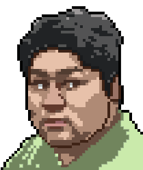
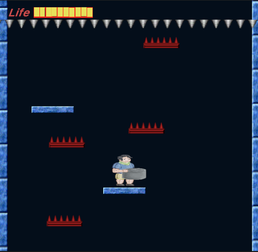
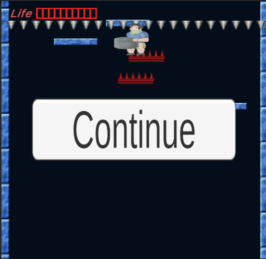

  
   
  <b>Run! Hot Pot Man!——2D Unity Game </b>
  
  

    
    
    
    
    
  

## Screenshot

## Try

-  Clone

git clone --depth=1 https://github.com/KyleAndKelly/Run-HotPot-Man-

- Run

[Build/Run! HotPot Man !.exe](Build/Run!%20HotPot%20Man%20!.exe)

## Todo list

## License

[MIT](https://opensource.org/licenses/MIT)